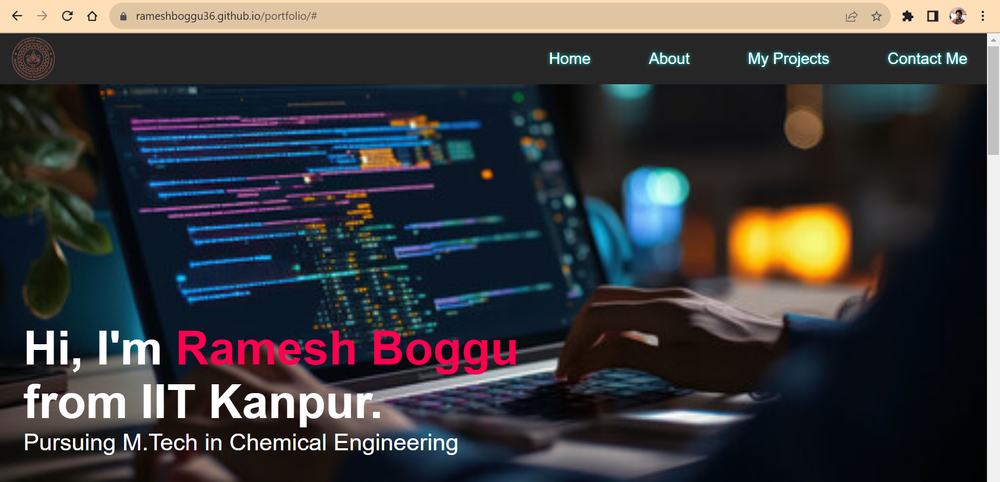
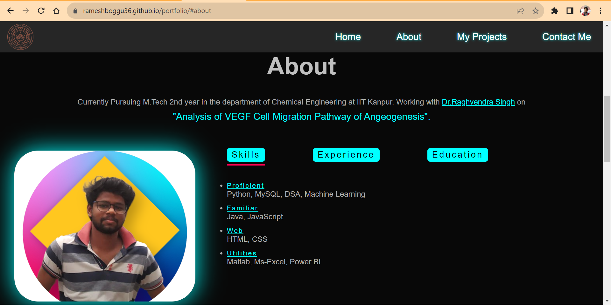
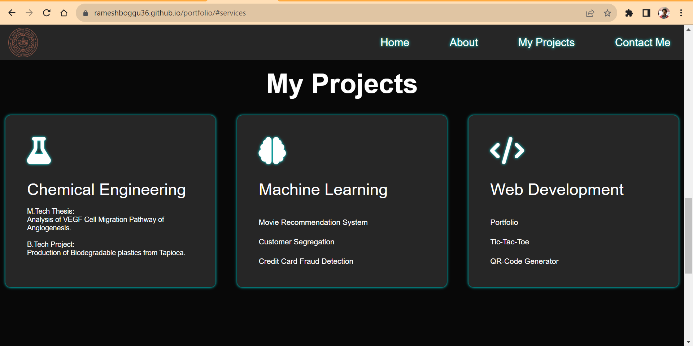
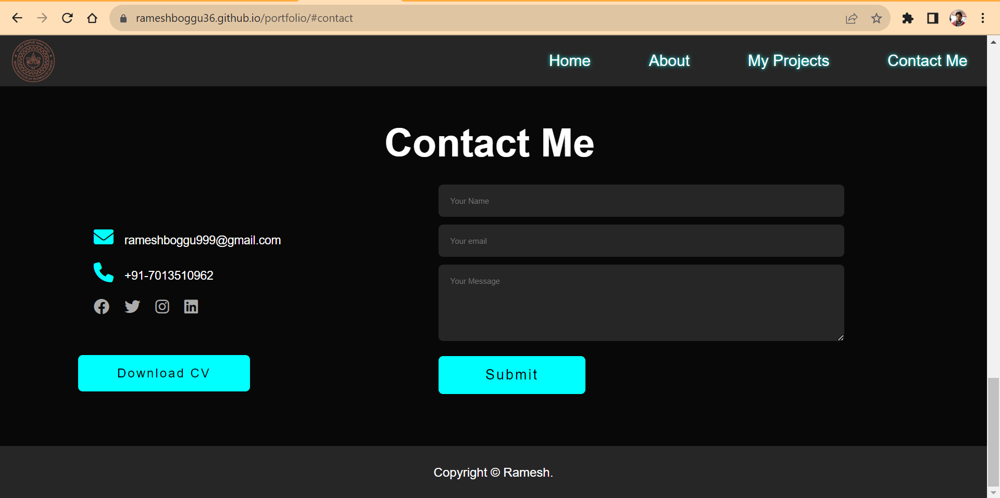

# Porfolio 
I created a personal portfolio, having three main sections.

About, Projects and Contact me.

You can find my portfolio here:
[_ramesh_boggu_porfolio_](https://rameshboggu36.github.io/portfolio/)

## Home 
This is how my porfolio home page looks like: 

## About

In this section, I included my skills, career information along with the educational background.

## Projects

In this section, I included my Master's Thesis, B.Tech Project and self projects on Machine learning and Web Devlopment.
I also provided the links to all self projects.

## Contact me

In this section I included my contact details such as mail, contact number and also provided a download button for my resume. 

I also included a google form section through which anyone can send me suggestions. 

